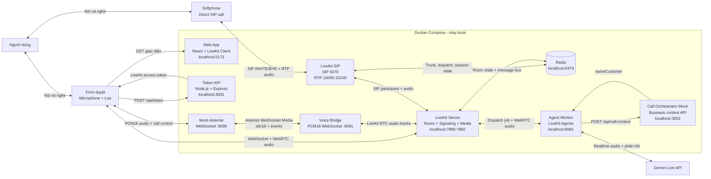
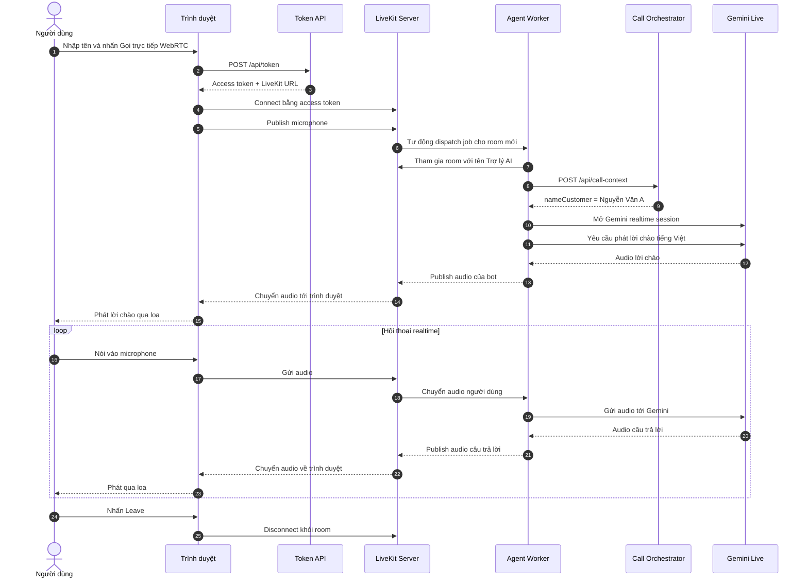
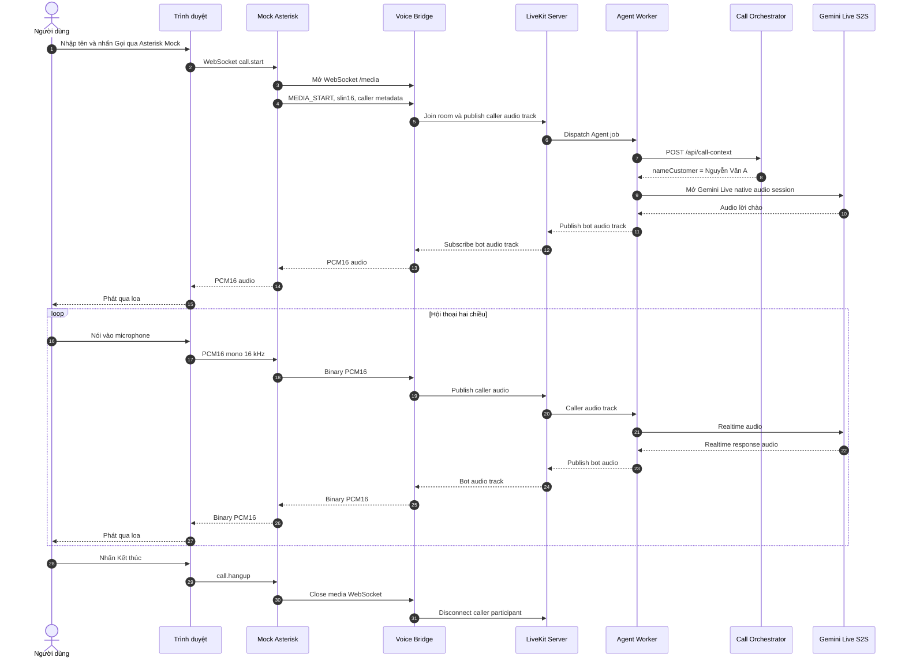
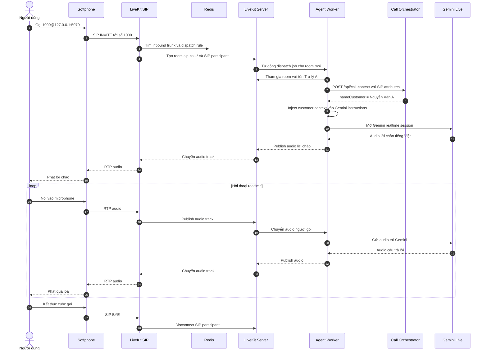

# LiveKit Gemini Callbot chạy local

Demo trợ lý giọng nói tiếng Việt sử dụng LiveKit và Gemini Live Speech-to-Speech. Người dùng có thể vào hệ thống bằng trình duyệt/WebRTC, softphone/LiveKit SIP hoặc luồng Asterisk WebSocket Media. Toàn bộ hạ tầng demo chạy bằng Docker Compose; chỉ Gemini Live API nằm bên ngoài máy local.

## Kiến trúc tổng quan



Bốn luồng dữ liệu chính:

- **Browser control/signaling:** trình duyệt lấy access token, kết nối room và LiveKit dispatch Agent Worker.
- **SIP control/signaling:** softphone gửi `INVITE` tới LiveKit SIP; trunk và dispatch rule tạo room/SIP participant.
- **Asterisk WebSocket Media:** trình duyệt demo gửi PCM16 tới Mock Asterisk; Mock chuyển media/event tới Voice Bridge, rồi Voice Bridge tham gia LiveKit room như caller. Khi dùng Asterisk thật, Asterisk thay thế Mock nhưng Voice Bridge và phần còn lại giữ nguyên.
- **Audio realtime:** microphone → LiveKit → Agent Worker → Gemini; audio trả lời đi ngược lại tới loa. Với SIP, LiveKit SIP chuyển đổi RTP thành track trong room.

`GOOGLE_API_KEY` và LiveKit API secret chỉ tồn tại ở backend/container, không được gửi xuống trình duyệt.

## Các thành phần

| Thành phần | Trách nhiệm | Giao tiếp chính | Port local |
|---|---|---|---|
| Web App | Hiển thị form join, quản lý microphone, phát audio và trạng thái participant | HTTP tới Token API; WebSocket/WebRTC tới LiveKit | `5173` |
| Token API | Kiểm tra tên/room và ký LiveKit access token | `POST /api/token`, `GET /health` | `3001` |
| Redis | Lưu SIP trunk, dispatch rule, session state và làm message bus cho LiveKit | Redis protocol | `6379` |
| LiveKit SIP | Nhận SIP call, xử lý RTP và tạo SIP participant trong room | SIP UDP/TCP, RTP UDP, Redis | `5070`, `10000-10100/udp` |
| Mock Asterisk | Mô phỏng Asterisk WebSocket Media để test từ browser mà không cần cài PBX | WebSocket browser `/call`; WebSocket Media tới Voice Bridge | `8090` |
| Voice Bridge | Ánh xạ call thành room/participant; chuyển PCM16 hai chiều giữa Asterisk và LiveKit | WebSocket `/media`; LiveKit RTC | `8091` |
| LiveKit Server | Quản lý room, participant, signaling và chuyển tiếp audio | WebSocket, WebRTC TCP/UDP, agent dispatch | `7880`, `7881`, `7882/udp` |
| Agent Worker | Nhận job, tham gia room với tên `Trợ lý AI`, điều phối Gemini realtime | LiveKit Agents và Gemini Live API | `8081` |
| Call Orchestrator Mock | Nhận thông tin cuộc gọi và trả về context nghiệp vụ giả lập | `POST /api/call-context`, `GET /health` | `3002` |
| Gemini Live API | Nhận audio, hiểu hội thoại và tạo audio trả lời tiếng Việt | Kết nối outbound từ Agent Worker | Internet |

## Luồng cuộc gọi từ trình duyệt



Điểm quan trọng: trình duyệt không gọi Gemini trực tiếp. Agent Worker giữ API key, kết nối Gemini và xuất hiện trong LiveKit room như một participant.

## Luồng Asterisk WebSocket Media



`Mock Asterisk` chỉ mô phỏng biên WebSocket Media cho local demo. Khi tích hợp Asterisk thật, cấu hình `chan_websocket`/dialplan mở media session tới `wss://<voice-bridge>/media`, codec `slin16` (PCM16 little-endian, mono, 16 kHz). Không cần thay đổi Agent Worker hay Gemini. Bản v1 đảm bảo audio hai chiều và call lifecycle; transfer cho nhánh Asterisk được để lại cho giai đoạn có mô hình PBX cụ thể.

## Luồng cuộc gọi từ softphone



Softphone gọi trực tiếp SIP URI và không đăng ký extension. LiveKit SIP không hỗ trợ `SIP REGISTER`.

## Chuẩn bị

### Yêu cầu môi trường

- Windows 10/11 với PowerShell.
- Docker Desktop và Docker Compose v2 đang chạy.
- Docker Desktop đã bật **Settings → Resources → Network → Enable host networking**.
- API key được tạo từ Google AI Studio.
- Softphone hỗ trợ gọi trực tiếp SIP URI, ví dụ Linphone hoặc MicroSIP.

Đảm bảo các port sau chưa bị ứng dụng khác sử dụng:

| Port | Thành phần |
|---|---|
| `3001/tcp` | Token API |
| `3002/tcp` | Call Orchestrator Mock |
| `5173/tcp` | Web App |
| `6379/tcp` | Redis |
| `7880-7881/tcp`, `7882/udp` | LiveKit Server |
| `8090/tcp` | Mock Asterisk browser WebSocket |
| `8091/tcp` | Voice Bridge health + media WebSocket |
| `5070/tcp,udp` | LiveKit SIP signaling |
| `10000-10100/udp` | LiveKit SIP RTP |

### Clone và cấu hình

```powershell
$repositoryUrl = "PASTE_REPOSITORY_URL_HERE"
git clone $repositoryUrl call_system
Set-Location call_system

# Các lệnh tiếp theo phải chạy tại thư mục chứa compose.yaml
Copy-Item .env.example .env
```

Mở `.env` và thay giá trị:

```env
GOOGLE_API_KEY=your_real_google_api_key
```

- Không commit `.env` và không đưa API key vào code frontend.
- Giữ nguyên `LIVEKIT_API_KEY=devkey` và `LIVEKIT_API_SECRET=secret` trong bản local vì LiveKit đang chạy với chế độ `--dev`.
- Giá trị `replace_with_your_google_ai_studio_key` chỉ là placeholder, không phải API key hợp lệ.

Agent hiện sử dụng model `gemini-2.5-flash-native-audio-preview-12-2025` và voice `Puck`. Đây là model preview; nếu Google thay đổi quyền truy cập hoặc ngừng model, kiểm tra log Agent và cập nhật cấu hình trong `apps/agent/src/config.ts`.

## Chạy hệ thống

```powershell
# Chạy tại thư mục chứa compose.yaml
docker compose up -d --build
docker compose ps
```

Các service `redis`, `web`, `token-api`, `call-orchestrator`, `voice-bridge`, `mock-asterisk` và `agent` cần có trạng thái `healthy`; `livekit`, `sip` và `egress` cần ở trạng thái `Up`. `sip-bootstrap` chạy một lần rồi phải có trạng thái `Exited (0)`.

Lần chạy đầu tiên có thể mất vài phút vì Docker phải tải image và build các service.

### Kiểm tra các endpoint

```powershell
# Token API
Invoke-RestMethod http://127.0.0.1:3001/health

# Call Orchestrator Mock
Invoke-RestMethod http://127.0.0.1:3002/health

# Mock Asterisk
Invoke-RestMethod http://127.0.0.1:8090/health

# Voice Bridge
Invoke-RestMethod http://127.0.0.1:8091/health

# Web App
Invoke-WebRequest -UseBasicParsing http://127.0.0.1:5173

# LiveKit SIP
Invoke-WebRequest -UseBasicParsing http://127.0.0.1:8082
Test-NetConnection 127.0.0.1 -Port 5070
```

Hai API health phải trả về:

```json
{"status":"ok"}
```

Theo dõi Agent Worker:

```powershell
docker compose logs -f agent
```

Log `registered worker` nghĩa là agent đã kết nối và đăng ký với LiveKit. Nhấn `Ctrl+C` chỉ thoát màn hình log, không dừng container.

> `agent` ở trạng thái `healthy` chỉ chứng minh worker đã khởi động và đăng ký với LiveKit. Trạng thái này không xác nhận `GOOGLE_API_KEY` còn hiệu lực; API key chỉ được kiểm tra khi Gemini session thực sự được mở.

## Test cuộc gọi bằng trình duyệt

1. Mở [http://localhost:5173](http://localhost:5173).
2. Nhập tên, ví dụ `Nguyễn Văn A`.
3. Chọn một trong hai nút và cho phép trình duyệt sử dụng microphone:
   - **Gọi trực tiếp WebRTC:** frontend tạo room có prefix `web-call-` và publish microphone trực tiếp vào LiveKit.
   - **Gọi qua Asterisk Mock:** browser gửi PCM16 qua `ws://localhost:8090/call`; Voice Bridge tạo room có prefix `asterisk-`.
4. Người dùng không cần nhập room kỹ thuật ở cả hai chế độ.
5. Chờ participant **Trợ lý AI** có nhãn **AI** xuất hiện.
6. Nghe lời chào, sau đó thử nói: `Xin chào, bạn có nghe thấy tôi không?`
7. Nhấn **Kết thúc** để đóng cuộc gọi.

Hai nút sử dụng hai đường media đầu vào khác nhau nhưng hội tụ tại LiveKit Server và dùng chung Agent Worker, Call Orchestrator, Gemini S2S và Egress. Luồng MicroSIP/SIP bên dưới vẫn giữ nguyên tại port `5070`.

Để theo dõi riêng luồng Asterisk Mock:

```powershell
docker compose logs -f mock-asterisk voice-bridge livekit agent
```

## Test cuộc gọi bằng softphone

### Cấu hình MicroSIP trên Windows

Không tạo SIP account và không nhập username/password để đăng ký với server. LiveKit SIP không hỗ trợ `SIP REGISTER`.

Trong MicroSIP:

1. Mở menu ở góc trên bên phải, chọn **Settings**.
2. Bật **Enable Local Account**.
3. Đặt **Source Port** thành `5090`.
4. Tắt STUN cho bài test local.
5. Đảm bảo `G.711 u-law` và `G.711 A-law` nằm trong danh sách **Enabled Codecs**.
6. Lưu Settings.
7. Mở Local Account:
   - **Account Name:** `Local (call by IP address)`.
   - **SIP Server, SIP Proxy, Username, Login, Password:** để trống.
   - **Media Encryption:** `Disabled`.
   - **Transport:** `TCP`.
8. Lưu Local Account.

Port đích của LiveKit SIP là `5070`, không phải `5060`. Việc dùng `5070` tránh xung đột với cổng SIP mà MicroSIP có thể tự chiếm trên Windows.

Trong ô gọi của MicroSIP, nhập:

```text
1000@127.0.0.1:5070
```

Vì Local Account đã chọn `TCP`, không cần thêm `;transport=tcp` vào ô gọi.

Trước khi gọi, mở log:

```powershell
docker compose logs -f sip agent call-orchestrator livekit
```

Luồng thành công:

1. Softphone gửi `INVITE` tới số `1000`.
2. LiveKit SIP tạo room có prefix `sip-call-`.
3. Caller xuất hiện dưới dạng SIP participant.
4. Agent nhận job và gọi Call Orchestrator bằng thông tin SIP.
5. Call Orchestrator trả `nameCustomer: "Nguyễn Văn A"` để Agent inject vào Gemini instructions.
6. Agent tham gia room, phát lời chào và hội thoại hai chiều.
7. Hỏi bot `Tôi tên là gì?` để xác nhận context đã được inject.
8. Khi softphone hang up, log nhận `BYE` và participant rời room.

Bootstrap chỉ chấp nhận destination number `1000`. Gọi số khác sẽ không match inbound trunk.

Trên Docker Desktop/Windows, hãy chọn transport **TCP** cho SIP signaling. RTP audio vẫn sử dụng UDP.

## Kiểm tra khi có lỗi

| Triệu chứng | Nguyên nhân thường gặp | Cách kiểm tra |
|---|---|---|
| `no configuration file provided` | Chạy Docker Compose ngoài thư mục dự án | Chuyển vào thư mục vừa clone, nơi có `compose.yaml` |
| Agent `healthy` nhưng cuộc gọi lỗi khi mở Gemini | `GOOGLE_API_KEY` vẫn là placeholder, sai, hết quota hoặc không được phép dùng model | Kiểm tra `.env` và `docker compose logs agent` |
| Call Orchestrator không healthy | Port `3002` bị chiếm hoặc mock server không khởi động | `docker compose ps call-orchestrator` và `docker compose logs call-orchestrator` |
| MicroSIP báo `Unsuitable transport selected` | Local Account chưa chọn TCP | Đặt Local Account → Transport thành `TCP`, lưu lại rồi gọi `1000@127.0.0.1:5070` |
| MicroSIP tự hiện `Incoming Call` | Cuộc gọi đang quay lại chính MicroSIP, thường do gọi nhầm port `5060` | Dùng port đích `5070` và Source Port `5090` |
| Softphone báo đăng ký thất bại | Đang dùng `REGISTER`, LiveKit SIP không phải extension registrar | Bỏ account/registration và dùng direct call SIP URI |
| Không thấy SIP `INVITE` trong log | Sai URI, host networking chưa bật hoặc Windows Firewall chặn | Kiểm tra `docker compose logs sip` và `Test-NetConnection 127.0.0.1 -Port 5070` |
| Call ringing nhưng không được answer | Agent chưa vào room hoặc chưa publish audio | Kiểm tra đồng thời `docker compose logs sip agent livekit` |
| Có signaling nhưng không có/thiếu một chiều audio | RTP/SDP không đi qua Docker host networking hoặc firewall | Kiểm tra dải UDP `10000-10100` và SIP log |
| `sip-bootstrap` exit khác `0` | Redis/LiveKit chưa sẵn sàng hoặc trunk/rule không hợp lệ | `docker compose logs sip-bootstrap livekit` |
| Agent không xuất hiện | Agent chưa chạy hoặc chưa đăng ký với LiveKit | `docker compose ps agent` và `docker compose logs agent` |
| Agent vào room nhưng không nói | Google key sai, hết quota hoặc Gemini Live không khả dụng | Tìm lỗi Gemini trong `docker compose logs agent` |
| UI báo chờ Agent quá lâu | Agent chưa đăng ký hoặc khởi động sau khi room được tạo | Kết thúc, kiểm tra `docker compose logs agent` rồi gọi lại |
| Không thu được tiếng | Trình duyệt chưa được cấp quyền microphone | Kiểm tra quyền microphone cạnh thanh địa chỉ |
| Không nghe được bot | Tab bị mute, sai thiết bị output hoặc autoplay bị chặn | Kiểm tra loa, volume và quyền phát audio của tab |
| Web không mở được | Container web/token API chưa healthy | `docker compose ps` và `docker compose logs web token-api` |
| Nút Asterisk Mock báo không kết nối được | `mock-asterisk` hoặc `voice-bridge` chưa healthy, hoặc port `8090/8091` bị chiếm | `docker compose ps mock-asterisk voice-bridge` và xem log hai service |
| Asterisk Mock kết nối nhưng không nghe bot | Agent/Gemini chưa phát audio hoặc bridge hết thời gian chờ | `docker compose logs agent voice-bridge`; kiểm tra Google key và `AGENT_START_TIMEOUT_MS` |
| Voice Bridge báo sai `MEDIA_START` | Asterisk gửi codec/frame format khác hợp đồng demo | Dùng `slin16`, mono, 16 kHz, PCM16 little-endian; gửi `MEDIA_START` trước binary audio |

## Lệnh thường dùng

```powershell
# Xem trạng thái
docker compose ps

# Xem log agent realtime
docker compose logs -f agent

# Xem toàn bộ đường SIP
docker compose logs -f sip agent call-orchestrator livekit

# Xem toàn bộ đường Asterisk WebSocket Media
docker compose logs -f mock-asterisk voice-bridge agent call-orchestrator livekit

# Chạy lại bootstrap; resource hiện có sẽ được tái sử dụng
docker compose run --rm sip-bootstrap

# Restart riêng agent
docker compose restart agent

# Dừng toàn bộ hệ thống
docker compose down
```

Nếu muốn chạy Compose từ thư mục khác:

```powershell
$repoPath = "C:\path\to\call_system"
docker compose -f "$repoPath\compose.yaml" --env-file "$repoPath\.env" up -d
```

## Chạy test

Token API:

```powershell
docker run --rm -v "${PWD}:/workspace" -w /workspace/apps/token-api node:22-alpine sh -c "npm test && npm run typecheck"
```

Web:

```powershell
docker run --rm -v "${PWD}:/workspace" -w /workspace/apps/web node:22-alpine sh -c "npm test && npm run typecheck && npm run build"
```

Agent:

```powershell
docker run --rm -v "${PWD}:/workspace" -w /workspace/apps/agent node:22-bookworm-slim sh -c "npm test && npm run typecheck && npm run build"
```

Call Orchestrator mock:

```powershell
docker run --rm -v "${PWD}:/workspace" -w /workspace/apps/call-orchestrator node:22-alpine npm test
```

Voice Bridge (cần image glibc vì LiveKit RTC có native binding):

```powershell
docker run --rm -v "${PWD}:/workspace" -v /workspace/apps/voice-bridge/node_modules -w /workspace/apps/voice-bridge node:22-bookworm-slim sh -c "npm ci && npm test && npm run typecheck && npm run build"
```

Mock Asterisk:

```powershell
docker run --rm -v "${PWD}:/workspace" -v /workspace/apps/mock-asterisk/node_modules -w /workspace/apps/mock-asterisk node:22-alpine sh -c "npm ci && npm test && npm run typecheck && npm run build"
```

## Demo cold transfer sang CTV

Agent cung cấp function tool `transfer_to_agent`. Gemini chỉ truyền lý do chuyển;
đích chuyển không nằm trong tham số của LLM. Agent gọi
`POST /api/transfer-target` tới Call Orchestrator, sau đó dùng LiveKit
`TransferSIPParticipant` để gửi SIP REFER.

Đích cố định của mock hiện tại:

```text
sip:2001@127.0.0.1:5092
```

Chuẩn bị hai softphone độc lập trên Windows:

1. Softphone khách hàng: Local Account, TCP, Source Port `5090`.
2. Softphone CTV: Local Account, TCP, Source Port `5092`, bật nhận cuộc gọi.
3. Nếu MicroSIP không cho mở hai tiến trình chung một cấu hình, dùng hai bản
   portable ở hai thư mục riêng hoặc dùng một softphone khác cho phía CTV.
4. Rebuild hai service vừa thay đổi:

```powershell
docker compose up -d --build call-orchestrator agent
docker compose logs -f sip agent call-orchestrator
```

Từ softphone khách hàng, gọi `1000@127.0.0.1:5070`. Sau khi bot trả lời, nói:
`Tôi cần gặp cộng tác viên để được hỗ trợ trực tiếp.` Bot phải hỏi xác nhận.
Trả lời: `Đồng ý, hãy chuyển giúp tôi.`

Khi Gemini gọi tool, log Call Orchestrator xuất hiện event
`transfer-target-selected` và softphone CTV ở port `5092` sẽ đổ chuông. Nếu tool
trả `unavailable` hoặc `failed`, bot tiếp tục hỗ trợ và không khẳng định đã chuyển.

> Cold transfer phụ thuộc endpoint/tổng đài phía cuộc gọi đến hỗ trợ SIP REFER.
> Khi lên production, thay URI local trong Call Orchestrator bằng extension hoặc
> SIP URI do hệ thống phân phối CTV lựa chọn; không để LLM tự sinh destination.

## Ghi âm cuộc gọi

Service `livekit/egress` dùng chung Redis với LiveKit Server và tự ghi toàn bộ
audio trong room, bao gồm cả người gọi và bot. Agent bắt đầu Room Composite
Egress trước khi phát lời chào Gemini. Khi room kết thúc, Egress hoàn tất file
MP3 và lưu qua Docker bind mount vào:

```text
./recordings/{room-name}-{timestamp}.mp3
```

Khởi động hoặc rebuild phần ghi âm:

```powershell
docker compose up -d --build egress agent
docker compose logs -f egress agent
```

Sau đó thực hiện một cuộc gọi bình thường tới `1000@127.0.0.1:5070`, nói chuyện
với bot và kết thúc cuộc gọi. Kiểm tra file:

```powershell
Get-ChildItem .\recordings\*.mp3
```

Trong log Agent phải có `[recording] started` và `egressId`. Nếu Egress lỗi,
Agent ghi `[recording] failed to start` nhưng vẫn tiếp tục phục vụ cuộc gọi.
Thư mục local này phù hợp cho demo; production nên cấu hình Egress upload lên
MinIO/S3 hoặc object storage tương đương.

## Giới hạn của bản local

Hệ thống dùng LiveKit development credentials cố định, SIP trunk local không có authentication, kết nối `ws://` không mã hóa và chưa có xác thực người dùng. Không expose stack này ra Internet.

Demo SIP chỉ nhận direct call tới số `1000`; chưa có SIP provider, DID/PSTN hoặc outbound calling. Service `Mock Asterisk` mô phỏng giao thức media để kiểm thử end-to-end, không phải một PBX Asterisk đầy đủ và không xử lý SIP trunk/dialplan.

Kết nối Mock Asterisk → Voice Bridge hiện dùng `ws://` trong Docker network. Production phải dùng `wss://`, xác thực/allowlist, timeout và giới hạn session; Asterisk thật chịu trách nhiệm SIP signaling, dialplan, codec negotiation và call events. Voice Bridge chỉ nhận PCM/event, ánh xạ session và đưa media vào LiveKit.

`compose.yaml` hiện dùng tag `latest` cho LiveKit Server và LiveKit SIP. Điều này phù hợp với demo nhưng không đảm bảo build có thể tái lập trong tương lai. Trước khi dùng cho môi trường ổn định, hãy pin các image về phiên bản đã kiểm thử.

Môi trường production cần TLS/SRTP, authenticated/restricted trunks, secret management, explicit agent dispatch, rate limiting, observability và cấu hình ICE/TURN/RTP phù hợp.
