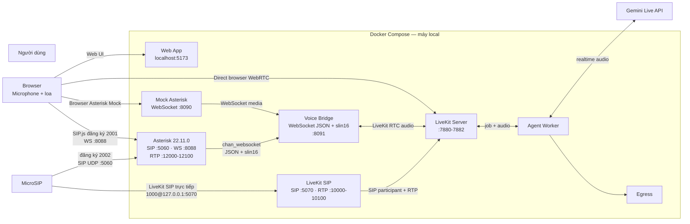

# LiveKit Gemini Callbot chạy local

Demo trợ lý giọng nói tiếng Việt dùng LiveKit và Gemini Live Speech-to-Speech. Hệ thống chạy bằng Docker Compose trên máy local; chỉ Gemini Live API là dịch vụ bên ngoài. `GOOGLE_API_KEY` chỉ nằm trong `.env` và container Agent, không được gửi xuống trình duyệt.

## Kiến trúc và các đường gọi



Có ba chế độ gọi từ trình duyệt, đều giữ nguyên và dùng chung Agent/Gemini:

| Chế độ | Nút trên web | Đường media đầu vào |
|---|---|---|
| WebRTC trực tiếp | `Gọi trực tiếp WebRTC` | Browser → LiveKit |
| Asterisk Mock | `Gọi qua Asterisk Mock` | Browser → Mock Asterisk `:8090` → Voice Bridge |
| Asterisk thật | `Gọi qua Asterisk thật` | SIP.js → Asterisk `:8088` → Voice Bridge |

Hai gateway SIP là độc lập: Asterisk `22.11.0` được build từ source và chạy `network_mode: host`; nó nhận máy nhánh đã đăng ký tại `5060`, còn LiveKit SIP vẫn nhận direct SIP URI tại `5070`. Asterisk route số `1000` qua `chan_websocket` đến Voice Bridge bằng JSON control messages và `slin16` (PCM16 little-endian, mono, 16 kHz); Voice Bridge tạo participant/room LiveKit và đưa audio bot quay lại Asterisk.

## Chuẩn bị và khởi động từ bản clone sạch

Yêu cầu Windows 10/11, PowerShell, Docker Desktop với Docker Compose v2. Trong Docker Desktop, bật **Settings → Resources → Network → Enable host networking**. Trình duyệt phải được cấp quyền microphone.

Trước khi chạy, các cổng host sau phải đang rảnh: TCP `3001`, `3002`, `5060`, `5070`, `5173`, `6379`, `7880-7881`, `8081-8082`, `8088`, `8090-8091`; UDP `5060`, `5070`, `7882`, `10000-10100`, `12000-12100`.

Tại thư mục gốc repository:

```powershell
Copy-Item .env.example .env
# Edit .env and set GOOGLE_API_KEY to the real Google AI Studio key.
docker compose up -d --build
docker compose ps
docker compose logs -f asterisk voice-bridge agent
```

Sửa `.env` để đặt khóa Google AI Studio thật; không commit file này hoặc chép khóa vào README/frontend. Các giá trị `LIVEKIT_API_KEY=devkey` và `LIVEKIT_API_SECRET=secret` chỉ dành cho local. Lần build đầu có thể mất vài phút. Web app không phụ thuộc health check của Asterisk: nếu Asterisk là gateway tùy chọn chưa sẵn sàng, web vẫn khởi động để dùng WebRTC trực tiếp hoặc Asterisk Mock.

Các endpoint local hữu ích:

```powershell
Invoke-RestMethod http://127.0.0.1:3001/health
Invoke-RestMethod http://127.0.0.1:3002/health
Invoke-RestMethod http://127.0.0.1:8090/health
Invoke-RestMethod http://127.0.0.1:8091/health
Invoke-WebRequest -UseBasicParsing http://127.0.0.1:5173
```

## Gọi qua Asterisk thật từ browser (SIP.js)

1. Mở [http://localhost:5173](http://localhost:5173).
2. Nhập tên khách hàng.
3. Nhấn **Gọi qua Asterisk thật**.
4. Cho phép truy cập microphone.
5. Chờ trạng thái **Cuộc gọi qua Asterisk đang hoạt động**, nghe lời chào TCBS, nói tiếng Việt, rồi nhấn **Kết thúc**.

Browser SIP.js dùng extension `2001`, mật khẩu `demo2001`, WebSocket `ws://localhost:8088/ws` và gọi số `1000`. Đây là thông tin demo local được gửi vào browser, không phải mẫu cấu hình production.

## Gọi qua Asterisk thật từ MicroSIP

Tạo tài khoản MicroSIP và đăng ký với Asterisk:

| Trường | Giá trị |
|---|---|
| SIP server/domain | `127.0.0.1` |
| SIP server port (đích) | `5060` |
| Local/source port | `Automatic` hoặc một cổng UDP đang rảnh |
| Username/login | `2002` |
| Password | `demo2002` |
| Transport | `UDP` |
| Media encryption | `Disabled` (chỉ demo local) |
| Enabled codecs | `G.711 u-law` và `G.711 A-law` |

`5060` là cổng đích của Asterisk. Để MicroSIP tự chọn local/source port (`Automatic`/random) hoặc chọn một cổng UDP đang rảnh; không đặt local/source port cố định là `5060`, vì Asterisk đã dùng cổng host đó. Sau khi registration thành công, gọi số `1000`. Asterisk xác thực `2002`, thương lượng G.711 với MicroSIP, rồi chuyển đổi và route media `slin16` đến Voice Bridge.

Không nhầm đường này với LiveKit SIP vẫn được giữ nguyên: direct call vào LiveKit SIP là `1000@127.0.0.1:5070`, không đăng ký extension và không dùng `5060`. LiveKit SIP không hỗ trợ `SIP REGISTER`.

## Các luồng cũ được giữ nguyên

- **WebRTC trực tiếp:** mở web, nhập tên, chọn `Gọi trực tiếp WebRTC`, cho phép microphone rồi hội thoại với bot.
- **Asterisk Mock:** chọn `Gọi qua Asterisk Mock`; browser gửi PCM16 đến `ws://localhost:8090/call`, sau đó Mock chuyển media đến Voice Bridge.
- **LiveKit SIP trực tiếp:** softphone gọi `1000@127.0.0.1:5070`; dùng local account/direct IP call, không username/password/REGISTER. Trên Windows chọn transport TCP cho luồng direct này nếu softphone yêu cầu; RTP vẫn UDP.

`transfer_call` chỉ là tính năng của luồng LiveKit SIP trực tiếp. Không coi transfer là tính năng hỗ trợ cho cuộc gọi bắt nguồn từ Asterisk (browser SIP.js, MicroSIP hay Asterisk Mock).

## Xác minh và xử lý sự cố

Kiểm tra Asterisk, service logs và cổng lắng nghe:

```powershell
docker compose exec -T asterisk asterisk -rx "pjsip show contacts"
docker compose exec -T asterisk asterisk -rx "core show channels verbose"
docker compose exec -T asterisk asterisk -rx "http show status"
docker compose logs --tail 200 asterisk voice-bridge agent egress
Get-NetTCPConnection -State Listen | Where-Object LocalPort -in 5060,5070,8088,8091
Get-NetUDPEndpoint | Where-Object LocalPort -in 5060,5070
```

| Triệu chứng | Kiểm tra trước tiên |
|---|---|
| Browser không đăng ký được | `http show status`, cổng `8088`, URL `ws://localhost:8088/ws`, extension `2001/demo2001` |
| MicroSIP báo unauthorized | Server `127.0.0.1:5060`, credentials `2002/demo2002`, transport UDP và `pjsip show contacts` |
| Có cuộc gọi nhưng không audio | Dải RTP `12000-12100` (Asterisk) và `10000-10100` (LiveKit SIP), Windows Firewall, danh sách codec G.711, log Voice Bridge |
| Bot không xuất hiện/không chào | `docker compose logs agent`, cấu hình `GOOGLE_API_KEY`, quota/model Gemini và log Voice Bridge |
| Cuộc gọi chạy nhưng không có recording | `docker compose logs egress agent`, sau đó kiểm tra `recordings/` |
| Web hoặc Mock Asterisk không kết nối | `docker compose ps`, log `web mock-asterisk voice-bridge`; kiểm tra `8090/8091` |

Để theo dõi riêng các luồng:

```powershell
docker compose logs -f asterisk voice-bridge agent
docker compose logs -f mock-asterisk voice-bridge agent
docker compose logs -f sip agent call-orchestrator livekit
```

## Ghi âm và cold transfer của LiveKit SIP

Egress ghi audio room thành MP3 vào `./recordings/{room-name}-{timestamp}.mp3`. Sau một cuộc gọi, kiểm tra bằng:

```powershell
Get-ChildItem .\recordings\*.mp3
```

Nếu cần thử cold transfer, chỉ dùng luồng LiveKit SIP direct (`1000@127.0.0.1:5070`). Agent yêu cầu xác nhận trước khi gọi `transfer_call`; đích transfer do Call Orchestrator chọn, LLM không tự tạo SIP URI.

## Lệnh vận hành và test

```powershell
docker compose ps
docker compose restart agent
docker compose run --rm sip-bootstrap
docker compose down
```

```powershell
docker run --rm -v "${PWD}:/workspace" -w /workspace/apps/token-api node:22-alpine sh -c "npm test && npm run typecheck"
docker run --rm -v "${PWD}:/workspace" -w /workspace/apps/web node:22-alpine sh -c "npm test && npm run typecheck && npm run build"
docker run --rm -v "${PWD}:/workspace" -w /workspace/apps/agent-py python:3.12-slim sh -c "pip install -q -r requirements.txt && python test_transfer.py"
docker run --rm -v "${PWD}:/workspace" -w /workspace/apps/call-orchestrator node:22-alpine npm test
docker run --rm -v "${PWD}:/workspace" -v /workspace/apps/voice-bridge/node_modules -w /workspace/apps/voice-bridge node:22-bookworm-slim sh -c "npm ci && npm test && npm run typecheck && npm run build"
docker run --rm -v "${PWD}:/workspace" -v /workspace/apps/mock-asterisk/node_modules -w /workspace/apps/mock-asterisk node:22-alpine sh -c "npm ci && npm test && npm run typecheck && npm run build"
```

## Ranh giới production

Thông tin browser cố định (`2001/demo2001`) và `ws://` chỉ dành cho localhost. Không expose stack demo ra Internet.

Production cần HTTPS/WSS và trusted certificates, DTLS-SRTP, cấp phát thông tin đăng nhập có xác thực và thời hạn ngắn, cấu hình NAT/external media, TURN khi cần, SIP/RTP allowlist, rate limit và chống gian lận SIP, quản lý secrets, metrics/call traces, pinned images và quét SBOM. Khởi đầu nên triển khai Asterisk trên Linux VM chuyên dụng có host networking; chưa nên đưa gateway này vào Kubernetes.
