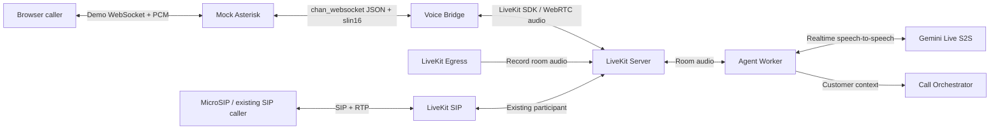
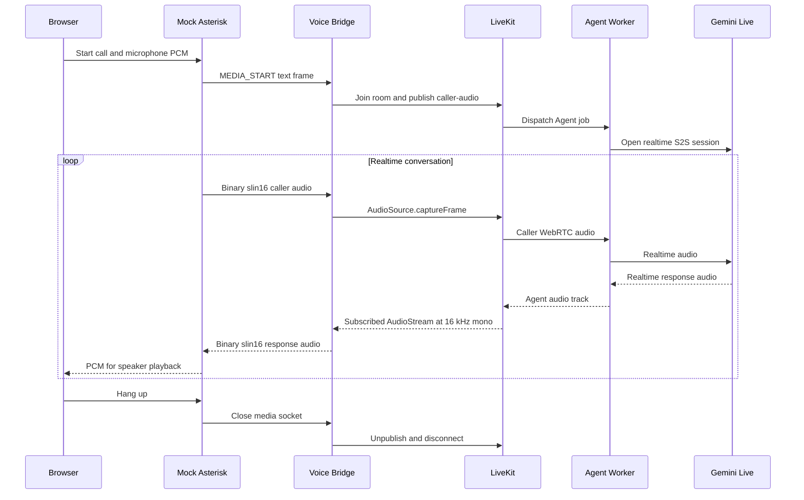

# Asterisk WSS to LiveKit Voice Bridge Design

**Date:** 2026-08-20

## Goal

Add an Asterisk-compatible WebSocket media path to the existing local LiveKit voice-agent demo. The new path must support stable, low-latency, bidirectional audio between a browser caller and the existing Gemini Live speech-to-speech agent.

This feature is additive. It must not remove or replace the existing browser WebRTC path, LiveKit SIP/MicroSIP path, Gemini agent, call orchestrator, Egress recording, or SIP cold-transfer behavior.

## Scope

### Included

- A new Voice Bridge service that accepts the Asterisk `chan_websocket` media protocol.
- `slin16`: signed PCM 16-bit little-endian, mono, 16 kHz.
- One Asterisk channel mapped to one Voice Bridge session, one LiveKit room, and one caller participant.
- Bidirectional audio between Asterisk WSS and a LiveKit room.
- A Mock Asterisk service for interactive local testing without installing Asterisk.
- An additive frontend mode that uses the browser microphone and speaker through Mock Asterisk.
- Customer-context lookup for bridged calls through the existing Call Orchestrator.
- Existing Egress recording for rooms created by the bridge.
- Backpressure, bounded buffering, lifecycle cleanup, logging, health checks, automated tests, and documentation.

### Excluded from this version

- Asterisk ARI call control.
- Cold transfer for calls entering through the Asterisk WSS bridge.
- Deployment of a real Asterisk server or Telco SIP trunk.
- Separate STT and TTS services. Gemini Live remains the realtime speech-to-speech service.
- High-availability clustering and production PKI automation.

The existing `transfer_to_agent` behavior for LiveKit SIP calls remains unchanged. Bridged Asterisk calls do not expose that tool until a concrete ARI call-control design is approved.

## Existing System Preservation

The following components and flows remain operational:

- `web` to LiveKit through direct browser WebRTC.
- MicroSIP to `livekit/sip` through SIP/RTP.
- LiveKit Server and Redis.
- Agent Worker and Gemini Live realtime S2S.
- Call Orchestrator customer-context lookup.
- LiveKit Egress room audio recording.
- LiveKit SIP cold transfer through `SipClient.transferSipParticipant`.

Implementation work will be isolated on a feature branch/worktree. Existing user changes, including unrelated modified files, must not be overwritten.

## Architecture



In production, Mock Asterisk is replaced with a real Asterisk deployment. The Voice Bridge and its LiveKit integration remain the same logical components.

## Components

### Voice Bridge

The new `apps/voice-bridge` service is the media boundary between Asterisk and LiveKit.

Responsibilities:

- Expose a WebSocket media endpoint compatible with outgoing Asterisk `chan_websocket` connections.
- Parse text control frames and binary media frames.
- Require a valid `MEDIA_START` event before accepting media.
- Validate `slin16`, mono, 16 kHz media.
- Create a LiveKit access token and join a deterministic room as the caller participant.
- Publish Asterisk PCM as a LiveKit microphone audio track.
- Subscribe only to the Agent's remote audio track.
- Convert subscribed Agent audio to 16 kHz mono PCM and send it to Asterisk.
- Respect `MEDIA_XOFF` and `MEDIA_XON` events.
- Bound all queues to protect realtime latency.
- Tear down tracks, room connections, queues, and sockets safely.
- Expose a health endpoint and structured call-correlated logs.

The service uses `@livekit/rtc-node`. Input audio is captured through `AudioSource(16000, 1)` and a local microphone track. Agent output is read through `AudioStream` configured for 16 kHz mono, allowing the SDK to supply frames in the required format.

### Mock Asterisk

The new `apps/mock-asterisk` service makes the bridge testable on Docker Desktop without installing or configuring Asterisk.

Responsibilities:

- Accept a local browser demo call.
- Create a unique mock Asterisk channel and connection ID.
- Connect as a WebSocket client to the Voice Bridge, matching an outgoing `chan_websocket` connection.
- Send a JSON `MEDIA_START` event followed by binary `slin16` frames.
- Forward binary response audio from Voice Bridge to the browser.
- Propagate call-ready, call-failed, and hangup states.
- Expose a health endpoint.

This is a compatibility test double, not a replacement for Asterisk. Its Voice Bridge-facing protocol follows the relevant Asterisk protocol contract.

### Frontend Asterisk Mock Mode

The existing frontend gains an additional call mode and retains its direct WebRTC mode.

Responsibilities:

- Capture microphone audio using the Web Audio API.
- Resample and encode audio as PCM16 mono 16 kHz.
- Send PCM to Mock Asterisk over a demo WebSocket.
- Decode received PCM and schedule it for speaker playback.
- Display connection, ringing/connecting, active, error, and ended states.
- Prevent simultaneous direct-WebRTC and Asterisk-Mock calls.
- Release microphone, AudioContext, worklet, and sockets on hangup.

The browser-to-Mock protocol is demo-only and intentionally separate from the Asterisk protocol.

### Agent Worker Changes

Changes to the existing Agent Worker are limited and backward compatible.

For customer-context lookup, participant attributes are resolved in this order:

1. `sip.callID` and `sip.phoneNumber` for existing LiveKit SIP calls.
2. `telephony.callId` and `telephony.phoneNumber` for Voice Bridge calls.
3. Existing identity-based fallback.

The transfer tool continues to be created only when `sip.callID` exists. A Voice Bridge participant therefore receives customer context but no transfer tool.

## Session Mapping

Each WSS connection owns exactly one call session:

```text
Asterisk channel ID
    -> Voice Bridge session
    -> LiveKit room
    -> Voice Bridge caller participant
```

Example identifiers:

```text
channel_id: mock-174521-42
room_name: asterisk-mock-174521-42
participant_identity: caller-mock-174521-42
```

Identifiers are normalized to a restricted character set and length before being used in LiveKit names.

The participant publishes these attributes:

```json
{
  "telephony.provider": "asterisk",
  "telephony.callId": "mock-174521-42",
  "telephony.phoneNumber": "0900000001"
}
```

Joining the new room causes LiveKit to dispatch the existing Agent Worker. The Agent connects, waits for the bridge participant, fetches customer context, opens Gemini Live, and publishes its response audio.

## Asterisk WebSocket Contract

Control messages are WebSocket text frames in JSON format. Media messages are WebSocket binary frames.

An example start event is:

```json
{
  "event": "MEDIA_START",
  "connection_id": "call-uuid",
  "channel_id": "mock-channel-uuid",
  "format": "slin16",
  "optimal_frame_size": 640,
  "ptime": 20,
  "channel_variables": {
    "CALLER_NUMBER": "0900000001"
  }
}
```

At 16 kHz, mono, signed 16-bit PCM, a 20 ms frame contains 320 samples and 640 bytes. The bridge validates that binary payload lengths are even and converts them to correctly offset `Int16Array` views or safe copies.

Supported control events in this version:

- `MEDIA_START`
- `MEDIA_XOFF`
- `MEDIA_XON`
- `DTMF_END` for correlated logging only

Unknown control events are logged at debug level and ignored unless they invalidate session state.

## Audio Data Flow



The Voice Bridge never subscribes to its own local caller track. It selects the remote Agent audio track, preventing caller-audio feedback loops.

## Backpressure and Latency

Realtime behavior takes priority over preserving old audio.

- Audio queues are bounded to approximately 500 ms.
- When a queue exceeds its bound, the oldest frames are discarded.
- The service emits counters or structured log fields for dropped frames.
- `MEDIA_XOFF` pauses outbound media toward Asterisk.
- `MEDIA_XON` resumes outbound media.
- LiveKit `captureFrame` backpressure must be awaited rather than creating unbounded promises.
- Browser playback uses a short scheduled buffer while avoiding cumulative delay.

The local acceptance test must run for at least five minutes without continuously increasing latency.

## Lifecycle and Error Handling

- A socket that does not send `MEDIA_START` within five seconds is closed.
- Duplicate `MEDIA_START` on one socket is rejected.
- Unsupported codecs or invalid session identifiers fail the call before joining LiveKit.
- Failure to connect to LiveKit sends a call-failed state to Mock Asterisk and cleans up the session.
- If no Agent audio track appears, the call remains connected only up to a configured startup timeout.
- Closing either WSS or the LiveKit room terminates the other side.
- Browser hangup closes the Mock Asterisk call and cascades cleanup.
- Cleanup operations are idempotent.
- Raw audio payloads, API secrets, and access tokens are never logged.

## Local Networking and Configuration

Proposed local ports:

- `8090`: Mock Asterisk browser WebSocket and health endpoint.
- `8091`: Voice Bridge Asterisk media WebSocket and health endpoint.

Voice Bridge configuration includes:

- `LIVEKIT_URL`
- `LIVEKIT_API_KEY`
- `LIVEKIT_API_SECRET`
- `VOICE_BRIDGE_PORT`
- `MEDIA_START_TIMEOUT_MS`
- `AGENT_START_TIMEOUT_MS`
- `MAX_AUDIO_BUFFER_MS`

Mock Asterisk configuration includes:

- `PORT`
- `VOICE_BRIDGE_URL`
- an optional local caller-number default

Local Docker connections use `ws://`. A production deployment uses `wss://`, service authentication, secret management, network allowlists, and trusted certificates.

## Testing Strategy

### Unit tests

Voice Bridge tests cover:

- `MEDIA_START` parsing and validation.
- PCM byte conversion and frame sizing.
- Safe identifier normalization.
- Single-session-per-socket enforcement.
- Bounded queues and drop policy.
- `MEDIA_XOFF/XON` state transitions.
- Agent-track selection.
- Idempotent cleanup.

Mock Asterisk tests cover:

- Correct start-event generation.
- Bidirectional binary forwarding.
- Ready, failed, hangup, and disconnect propagation.

Agent tests cover:

- Existing SIP attribute precedence.
- New `telephony.*` attribute support.
- Identity fallback.
- Transfer tool remaining restricted to SIP calls.

Frontend tests cover:

- Mode selection.
- Call-state transitions.
- Start and hangup behavior.
- Prevention of concurrent call modes.
- PCM conversion helpers.

### Integration and regression tests

The full local path is:

```text
Browser -> Mock Asterisk -> Voice Bridge -> LiveKit
        -> Agent -> Gemini Live -> reverse audio path
```

Regression checks cover:

- Existing browser direct-WebRTC call.
- Existing MicroSIP to LiveKit SIP call.
- Existing SIP `transfer_to_agent` behavior.
- Existing Egress recording output.
- Existing automated test suites.

## Acceptance Criteria

1. `docker compose up --build` starts the existing system plus both new services.
2. New services pass health checks.
3. The caller hears the Gemini Vietnamese greeting through Asterisk Mock mode.
4. Caller speech reaches Gemini and audible responses return to the browser.
5. Barge-in remains usable.
6. No caller-audio echo loop is introduced.
7. A five-minute conversation does not accumulate increasing bridge latency.
8. Logs correlate `connectionId`, `channelId`, `callId`, and `roomName`.
9. Hangup releases browser, WebSocket, audio-track, and LiveKit room resources.
10. The new room is recorded by the existing Egress flow.
11. Direct browser WebRTC and MicroSIP calls continue to work.
12. Existing SIP cold transfer remains unchanged.
13. Existing and new automated tests pass.
14. README documents architecture, startup commands, and both old and new demo paths.

## Deferred Production Work

- Asterisk ARI integration for redirect, transfer, originate, and bridge control.
- Real Telco SIP trunk configuration.
- WSS authentication, mTLS, certificate rotation, and IP allowlisting.
- Multi-instance session ownership and distributed routing.
- Load and soak testing at the intended concurrent-call volume.
- Production metrics, dashboards, alerts, and call tracing.
- Explicit retry policies across Asterisk, Voice Bridge, LiveKit, and Gemini.

