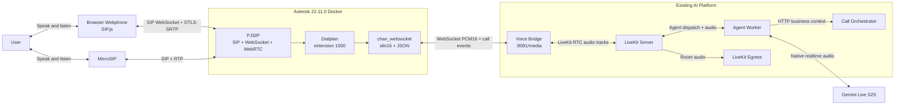

# Asterisk SIP Gateway and Browser Webphone Design

Date: 2026-08-31

## Goal

Add a real Asterisk SIP gateway to the existing local LiveKit/Gemini callbot without removing or changing the existing direct WebRTC, Mock Asterisk, or LiveKit SIP demo paths. Both a browser webphone and MicroSIP must be able to call extension `1000` through Asterisk and have a two-way Gemini Live speech-to-speech conversation.

## Scope

This increment includes:

- A custom Docker image built from the official Asterisk `22.11.0` source release.
- PJSIP endpoints for a local browser webphone and MicroSIP.
- Browser SIP signaling over WebSocket and WebRTC media using SIP.js.
- An Asterisk dialplan that routes extension `1000` to the existing Voice Bridge through `chan_websocket` using `slin16` and JSON control messages.
- Docker Compose wiring, health checks, documentation, and automated tests for code owned by this repository.
- Manual end-to-end verification for browser and MicroSIP audio.

This increment does not include a Telco SIP trunk, DID/PSTN connectivity, outbound campaigns, high availability, Kubernetes, production PKI, or `transfer_to_agent` for Asterisk-originated calls.

## Existing Paths That Must Remain

1. Browser direct WebRTC -> LiveKit Server.
2. Browser -> Mock Asterisk -> Voice Bridge -> LiveKit Server.
3. MicroSIP -> LiveKit SIP on port `5070` -> LiveKit Server.
4. LiveKit Egress recording, Call Orchestrator context lookup, and Gemini Live native audio.

Mock Asterisk remains an automated test harness and is not replaced by the real Asterisk service.

## Architecture



## Asterisk Container

The repository will add `apps/asterisk` with a multi-stage Dockerfile. The build stage downloads the official `asterisk-22.11.0.tar.gz`, verifies its SHA-256 checksum, compiles required modules, and installs into a minimal runtime stage. The image must not use an unpinned community Asterisk image.

Required configuration files:

- `asterisk.conf`: runtime directories and non-interactive console behavior.
- `modules.conf`: explicitly load PJSIP, HTTP/WebSocket, WebRTC codec, and `chan_websocket` modules required by the demo.
- `pjsip.conf`: UDP/TCP transport for MicroSIP plus WebSocket/WebRTC transport and demo endpoints.
- `extensions.conf`: route called extension `1000` to the Voice Bridge.
- `rtp.conf`: use UDP ports `12000-12100` to avoid the LiveKit SIP range.
- `http.conf`: expose the Asterisk HTTP/WebSocket server on port `8088`.
- `websocket_client.conf`: define a per-call outbound media WebSocket connection named `voicebridge`.
- `chan_websocket.conf`: select JSON control messages.

The runtime service runs as a non-root `asterisk` user, persists only runtime spool/log data, mounts configuration read-only, and exposes a CLI-based health check.

## Demo Identities

The local-only credentials are deterministic:

| Client | Extension | Password | Called number |
|---|---:|---|---:|
| Browser SIP.js | `2001` | `demo2001` | `1000` |
| MicroSIP | `2002` | `demo2002` | `1000` |

These credentials are explicitly development-only. Production credentials must come from a secret manager or PBX provisioning system.

## Dialplan and Media Contract

When either endpoint calls `1000`, Asterisk executes the equivalent of:

```text
Dial(WebSocket/voicebridge/c(slin16)f(json))
```

Asterisk opens one outbound WebSocket media connection per call to `ws://127.0.0.1:8091/media` in the local environment. Because Asterisk uses host networking and Voice Bridge publishes port `8091` on the Docker host, loopback is the stable local address.

The existing Voice Bridge already accepts the native JSON `MEDIA_START` fields used by Asterisk and binary little-endian PCM16 frames. It also handles `MEDIA_XOFF`, `MEDIA_XON`, `DTMF_END`, bounded buffering, call closure, and LiveKit participant cleanup. Implementation must add compatibility tests using representative native Asterisk messages before relying on the live PBX.

Asterisk provides `slin16` to the Voice Bridge regardless of the caller-side codec. Asterisk is responsible for codec negotiation, transcoding, media timing, SIP lifecycle, and DTLS-SRTP for browser calls.

## Browser Webphone

The React application adds SIP.js behind a small adapter so UI components do not depend directly on SIP.js types. A third call mode named `Gọi qua Asterisk thật` is added alongside the two existing modes.

Local configuration:

```env
VITE_ASTERISK_WS_URL=ws://localhost:8088/ws
VITE_ASTERISK_DOMAIN=localhost
VITE_ASTERISK_EXTENSION=2001
VITE_ASTERISK_PASSWORD=demo2001
VITE_ASTERISK_DESTINATION=1000
```

The adapter owns registration, invitation, remote audio attachment, microphone acquisition, hangup, and cleanup. UI states are `idle`, `registering`, `calling`, `active`, `ended`, and `failed`. The password is acceptable only for this local demo; the README must warn that Vite variables are visible to browser users.

Local HTTP on `localhost` is used for the demo. Production requires HTTPS, WSS, trusted certificates, authenticated provisioning, and ICE/TURN appropriate to the deployment network.

## Ports and Networking

| Component | Ports |
|---|---|
| Asterisk PJSIP | `5060/tcp,udp` |
| Asterisk HTTP/SIP WebSocket | `8088/tcp` |
| Asterisk RTP | `12000-12100/udp` |
| Existing LiveKit SIP | `5070/tcp,udp` |
| Existing LiveKit SIP RTP | `10000-10100/udp` |
| Voice Bridge | `8091/tcp` |
| LiveKit Server | `7880-7881/tcp`, `7882/udp` |

Asterisk uses `network_mode: host`, matching the existing Windows Docker Desktop setup used by LiveKit SIP. The documented prerequisite remains Docker Desktop host networking enabled. Asterisk and LiveKit SIP coexist because all SIP and RTP port ranges are disjoint.

## Call Sequence

1. SIP.js or MicroSIP registers its demo extension with Asterisk.
2. The client calls extension `1000`.
3. Asterisk authenticates the endpoint and enters the AI dialplan context.
4. `chan_websocket` opens a per-call connection to Voice Bridge using `slin16` and JSON control messages.
5. Voice Bridge receives `MEDIA_START`, creates a deterministic `asterisk-*` LiveKit room, joins as the caller, and publishes caller audio.
6. LiveKit dispatches Agent Worker.
7. Agent Worker requests customer context, starts Egress, opens Gemini Live, and publishes the bot audio track.
8. Voice Bridge returns bot PCM16 audio to Asterisk; Asterisk transcodes and sends it to the caller.
9. SIP BYE, browser hangup, WebSocket closure, timeout, or LiveKit disconnect triggers idempotent cleanup on every layer.

## Error Handling

- Asterisk build fails if the tarball checksum or required module build fails.
- Asterisk health fails when the CLI cannot connect or required modules are not loaded.
- Browser registration and invitation have explicit timeouts and map SIP failures to concise Vietnamese UI messages.
- Browser cleanup always terminates the SIP session, unregisters/stops the SIP user agent, detaches media, and stops local microphone tracks.
- Asterisk rejects unknown endpoints and extensions outside the demo configuration.
- If Voice Bridge cannot connect or the Agent produces no audio before timeout, the media WebSocket closes and the SIP call ends without leaking a LiveKit room.
- Voice Bridge continues to obey Asterisk flow-control events.
- Failure to start Egress remains non-fatal to the conversation.

## Testing and Acceptance Criteria

Automated checks:

- Asterisk image builds reproducibly from pinned source and checksum.
- Static configuration assertions cover ports, demo endpoints, JSON `chan_websocket`, `slin16`, and extension `1000` routing.
- Container health verifies the running Asterisk core and required modules.
- Voice Bridge tests parse representative Asterisk JSON control events and preserve flow control.
- Web adapter tests registration, call establishment, remote audio, hangup, error mapping, and cleanup using mocked SIP.js primitives.
- UI tests cover all new call states and confirm both old buttons remain functional.
- Existing Agent, Web, Voice Bridge, Mock Asterisk, Token API, and Call Orchestrator suites remain green.

Manual end-to-end acceptance:

1. Browser extension `2001` registers and calls `1000`.
2. MicroSIP extension `2002` registers and calls `1000@127.0.0.1:5060`.
3. Both callers hear the TCBS greeting and can hold a two-way Vietnamese conversation with Gemini Live.
4. Agent logs show the `asterisk-*` room and customer context lookup.
5. Hangup removes the caller and Agent without restarting Voice Bridge.
6. Egress produces a non-empty MP3 for each completed call.
7. Direct WebRTC, Mock Asterisk, and LiveKit SIP port `5070` demos still work.

## Security and Production Boundary

This remains a local demo. It uses fixed extension credentials, unencrypted local WebSocket connections, development LiveKit credentials, and no rate limiting. It must not be exposed to the Internet.

Production requires TLS/WSS, SRTP, trusted certificates, strong endpoint/trunk authentication, firewall allowlists, secret management, SIP fraud controls, external-address/NAT configuration, monitoring, and pinned image/SBOM scanning. Asterisk should initially run on a dedicated Linux VM with host networking rather than Kubernetes.

## Delivery Strategy

Implementation builds on `feature/asterisk-wss-voice-bridge` in a new isolated branch/worktree. Commits are divided into Asterisk image/config, native protocol compatibility, browser SIP adapter/UI, Compose/docs, and end-to-end verification. The previously pushed branch and its existing demo paths are preserved.
